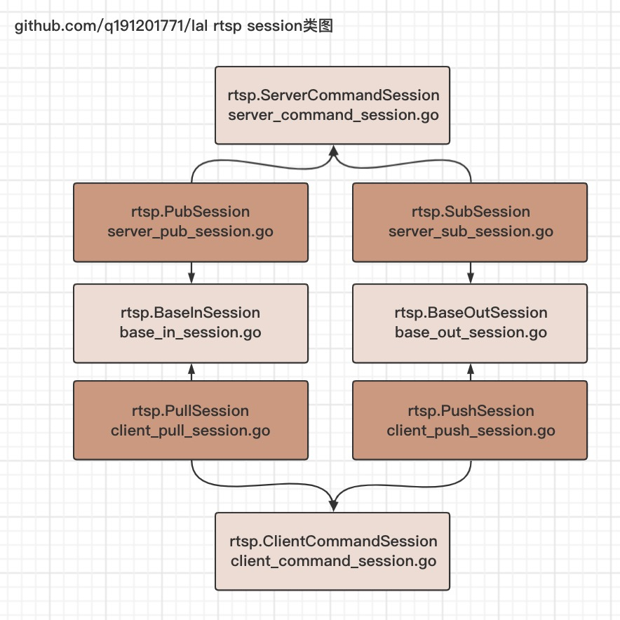

# 连接类型之session pub/sub/push/pull

流媒体传输，通常指持续性在网络上传输流式音视频数据。  
一条传输数据的网络通道，由两端组成，下面我们对不同情况下的两端做定义。  

### 连接建立方向角度，ClientSession, ServerSession

从连接建立方向角度，分为主动发起端，和被动处理端。

比如over TCP的连接：

- 调用connect，连接对方的称为主动发起端
- 调用accept，处理连接的称为被动处理端

很多时候，我们会把

- 主动发起端称为client客户端
- 被动处理端称为server服务端

注意，这种client，server的划分是一种特定含义的划分。client客户端并不仅仅是指PC、APP、Web等运行在C端的程序，也可以是在一个服务器上的服务，比如服务A使用connect连接另外一个服务器上的服务B。

从连接建立方向角度，主动发起端称为client session，被动处理端称为server session：

```
             connect       accept
+-----------------+         +-----------------+
|  ClientSession  |  ---->  |  ServerSession  |
+-----------------+         +-----------------+
```
### 音视频数据发送方向角度，(AVData)InSession, OutSession

除了连接建立方向角度，另一个角度是音视频数据发送方向角度：

- 数据发送端，也即(AVData)OutSession
- 数据接收端，也即(AVData)InSession

注意，此处说的数据都是指音视频数据。而不是连接建立后，业务层协议中握手、发布、订阅等信令数据。

由于连接建立方向和数据发送方向可能一致也可能相反，所以又分为4种角色：

### PushSession, PullSession, PubSession, SubSession

A连接B，A向B发送数据：

```
A | --connect--> | B
  | --av data--> |
```

上面这种情况：

- A属于`ClientSession`+`OutSession`，我们称之为`PushSession`
- B属于`ServerSession`+`InSession`，我们称之为`PubSession`

另一种情况，A连接B，B向A发送数据：

```
A | --connect--> | B
  | <--av data-- |
```

上面这种情况：

- A属于`ClientSession`+`InSession`，我们称之为`PullSession`
- B属于`ServerSession`+`OutSession`，我们称之为`SubSession`

*注，Pub/Sub是Publish/Subscribe的缩写*

**注意，Push、Pull、Pub、Sub这四种session的定义是我个人下的定义，没有业界标准。只是在lal以及相关项目、文档中的一个共识。**

> 命名上的相关讨论： https://github.com/q191201771/lal/issues/243

### 为什么要统一命名

有两点好处：

一，便于沟通

比如说一个流媒体模块支持rtmp推流。那么究竟是说它可以处理别人给它推rtmp流，还是说它可以将流用rtmp格式推送给别人？  
有了命名，第一种情况对应pub，第二种情况对应push。

比如说一个流媒体模块支持rtmp推流，rtsp拉流。那么究竟是说别人将rtmp流推给它，然后另外一个人从它这拉rtsp流；还是说它主动从别人那拉rtsp流，然后再将流转换成rtmp格式推送出去呢？  
有了命名，第一种情况对应`rtmp pub+rtsp sub`，第二种情况对应`rtsp pull -> rtmp push`。

现在，通过[《lalserver简介》](LALServer.md)中的协议支持表格，你可以很清晰的知道lalserver支持哪些协议，以及哪些协议可以转换。  
通过，通过[《Demo简介》](DEMO.md)中的各demo名称，你可以很清晰知道它们的作用。

二，便于组织与复用代码

拿rtsp协议举例：

1. pub和sub作为server端，信令部分的处理有大部分是相同的，同理，push和pull作为client端也是如此
2. 另外，pub和pull作为接收(in)音视频数据流端，有大部分逻辑是相同的，同理，sub和push作为(out)发送音视频数据流端也是如此



原创不易，转载请注明文章出自开源流媒体服务器[lal](https://github.com/q191201771/lal)，Github：[https://github.com/q191201771/lal](https://github.com/q191201771/lal)  官方文档：[https://pengrl.com/lal](https://pengrl.com/lal)  

yoko, 20210206
