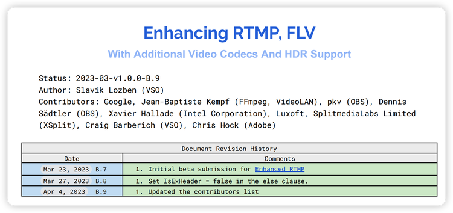
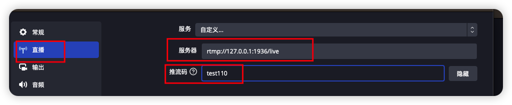

## ▦ Background

As we all know, the RTMP protocol is widely used in live broadcast scenarios. At present, live streaming generally uses RTMP for streaming, but Adobe has no longer updated RTMP. Therefore, for some new encoding formats, the standard FLV format does not support encoding such as HEVC.  
The Chinese cloud service provider Kingsoft Cloud defines CodecID=12 as the CodecID of HEVC, and many streaming media services in China are also implemented according to this standard, but for some open source tools such as `ffmpeg` and OBS, they do not support this Chinese standard.

## ▦ Enhanced RTMP/FLV

Recently, Veovera Software Organization (VSO) proposed [enhanced RTMP](enhanced_rtmp.md), aiming to enable RTMP/FLV to support currently popular encoding formats, such as HEVC, VP9, and AV1. Judging from the documents, well-known institutions such as FFmpeg, VideoLAN (VLC), OBS, and Adobe participated in this standard, indicating that this new standard will be widely used in the near future.



According to the latest document, currently enhanced RTMP/FLV only supports HEVC, VP9, AV1 and other video encoding formats. I believe that audio encoding formats will also be supported in the near future, therefore we will not need to modify `ffmpeg` by then. The entry barrier will be greatly reduced. However, the new RTMP/FLV standard is not exactly the same as the Chinese general standard, but <font color="red">the new standard is compatible both with the old and the Chinese standards</font>, and it is very easy to support.

## ▦ Format specification

The RTMP internal load also uses the FLV Tag, so here we mainly explain the enhanced FLV Video Tag format.

### ▦ Standard FLV Video Tag


In the standard FLV format, the Video Tag is composed of the Tag Header and the Tag Body. Tag Header is fixed at 5 bytes, and the codec information can be judged by the last 4 bits of the first byte.

### ▦ Enhanced FLV Video Tag


In the Enhanced FLV standard, the 5 bytes of the Video Tag Header become the above format.

1. `header[0]&0x80` can be used to determine whether it is enhanced FLV or not.
2. PacketType from the original standard 2 bytes into the first byte after the 4bits, if PacketType = 0, that is, sequence header, after the Tag Body comes the `CodecConfigurationRecord` part; for instance, HEVC is `HEVCDecoderConfigurationRecord`. If PacketType = 1 or PacketType = 3, it means that Tag Body is NALus, but note that, with PacketType = 1, the first 3 bytes of Tag Body are the Composition Time.

## ▦ Current server/client support for Enhanced RTMP/FLV

```
OBS: OBS 29.1+
srs: 6.0.42+
mpegts: 1.7.3+
lal: 0.35.4+
```

## ▦ How to test it

(1) Open OBS and in "Output" select HEVC in the video encoder.


(2) Input the address of RTMP in "Live", e.g.: `rtmp://127.0.0.1:1935/live/test110`



(3) Use `ffplay` or VLC to play RTSP or HLS streams

(4) If you want to play FLV streams, since `ffmpeg` and VLC don't support this standard yet, you can use `mpegts.js` to test it, I use srs's player here, and just enter lal's HTTP-FLV stream pull address in the URL.


axiang, 202304

*Translators' note: the images contain text that has not been translated yet. TODO(gwyneth)*