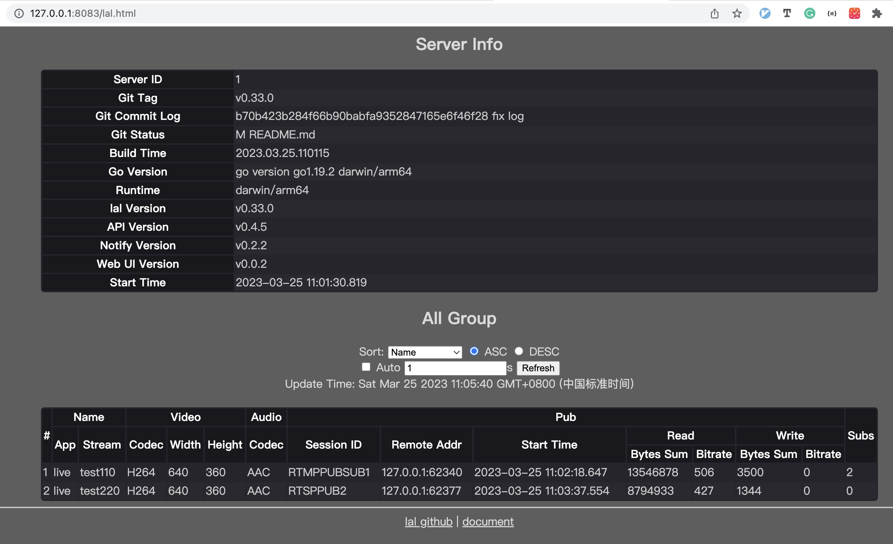

# lalserver Web UI Visualisation

After launching lalserver, access it by typing http://127.0.0.1:8083/lal.html in your browser.

Below are some screenshots, for a more specific description you can take a look at the [v0.34.3 release documentation](brief_v0.34.3.md).

Figure 1: The basic information of the service and the group list information:

Figure 2: Group-specific information:

**NOTE:** HttpWebUiVersion = "v0.0.2"
